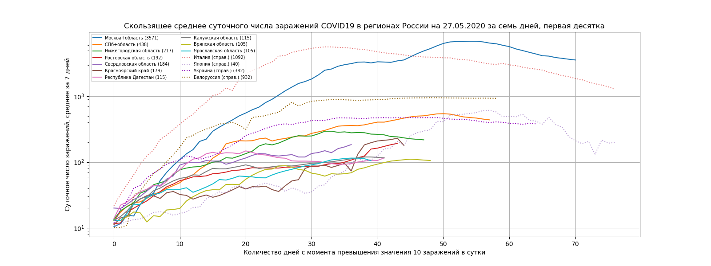
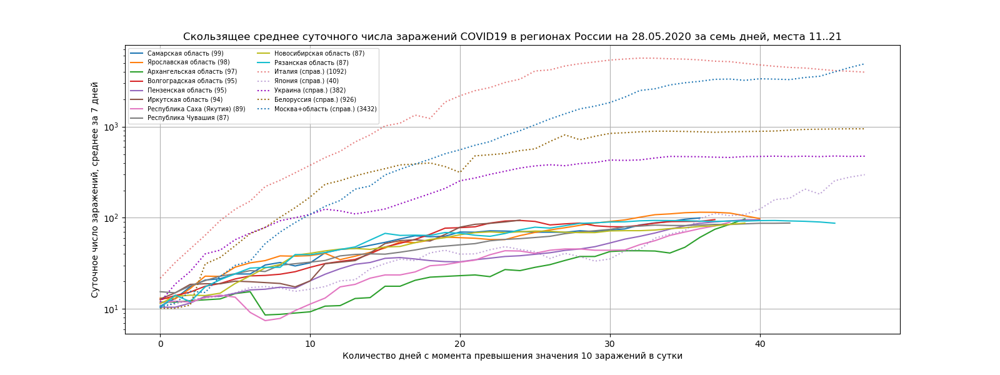
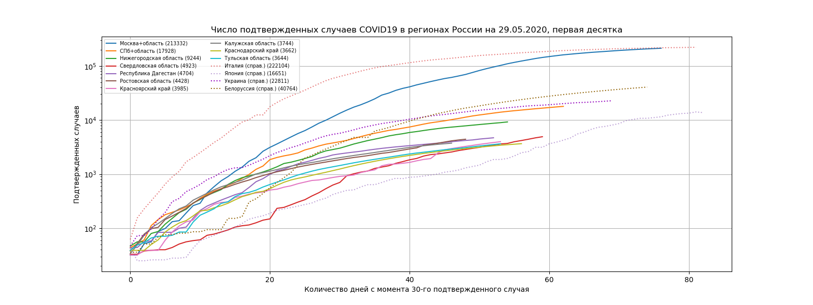
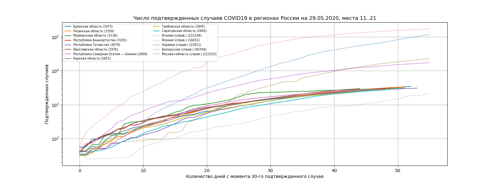

# COVID-19 Data Repository by the Center for Systems Science and Engineering (CSSE) at Johns Hopkins University

### Goals

1. Provide COVID19 dataset containing detailed information on Russia.
2. Maintain CSSE compatibility
3. Provide some higher level APIs for accessing the data.
4. Close the project after a more systematic approch is developed

* [Upstream issue](https://github.com/CSSEGISandData/COVID-19/issues/1262)
* [Generic local discussion (if any)](https://github.com/grwlf/COVID-19_plus_Russia/issues/1)

_Disclamer: the author doesn't have relationships with any government or
commercial organisations. The data provided here are collected from unreliable
sources and may be not accurate. Use it at your own risk._

_Отказ от ответственности: автор не имеет отношения к государственным или
коммерческим организациям. Данные, приведенные здесь, собраны из ненадежных
источников и могут быть неточными. Используйте их на свой страх и риск._

### Contents

* [Directory structure](#directory-structure)
* [Visualization](#visualization)
* [Data sources](#data-sources)
* [Update procedure](#update-procedure)
* [Road map](#road-map)
* [Log](#log)

### Directory structure

* [csse_covid_19_data/csse_covid_19_daily_reports](./csse_covid_19_data/csse_covid_19_daily_reports)
  contains CSV files which were released by CSSE and later amended by us. Files
  released after March 25 were updates with additional information on Russian regions.
* [csse_covid_19_data/csse_covid_19_time_series](./csse_covid_19_data/csse_covid_19_time_series)
  folder contains additional auto-generated timeseries on Russian regions.
* [python3](./python3) folder contains Python development tools:
  - [covid19ru.check](python3/src/covid19ru/check.py) module for checking certain invariants
  - [covid19ru.fetch](python3/src/covid19ru/fetch.py) Yandex data fetcher
  - [covid19ru.access](python3/src/covid19ru/access.py) Data accessor API
  - [covid19ru.plot](python3/src/covid19ru/plot.py) Matplotlib plotting

### Visualization

**Daily cases in Russian regions, Top-10**



[English version of the plot](python3/ruscovid_ma.png)


**Daily cases in Russian regions, positions 11-21**



[English version of the plot](python3/ruscovid_ma_10_20.png)


**Confirmed cases in Russian regions, Top-10**



[English version of the plot](python3/ruscovid.png)


**Confirmed cases in Russian regions, positions 11-21**



[English version of the plot](python3/ruscovid_10_20.png)

### Data sources

#### Primary sources

* [Yandex COVID19 map](https://yandex.ru/maps/covid19)
  - The Yandex company provides current per-region numbers.
* https://github.com/CSSEGISandData/COVID-19
  - Upstream world data by CSSE.
* [Rospotrebnadzor](https://www.rospotrebnadzor.ru/about/info/news/)
  - The supposedly original official data source of COVID19 data in Russia.
    Data is published in Russian as a plain text. The source provides daily
    difference per region and current total for the whole state. Example:
    <https://www.rospotrebnadzor.ru/about/info/news/news_details.php?ELEMENT_ID=14125>
* [NovelCoronaVirusChannel at Telegram](https://t.me/NovelCoronaVirusChannel)
  - Random COVID19 news in Russian.
* <https://стопкоронавирус.рф//#>

#### Related repos

* https://dash-coronavirus-2020.herokuapp.com
* https://github.com/AlexxIT/YandexCOVID
* https://github.com/klevin92/covid19_moscow_cases
* https://github.com/wolfxyx/moscow-covid-19
* https://github.com/AaronWard/covid-19-analysis

### Update procedure

Originally, author filled the data on Moscow and Saint Petersburg manually,
based on `Rospotrebnadzor` and `NovelCoronaVirusChannel` data. Starting from
March, 25 we follow the below procedure:

1. Fetch hourly data from `Yandex COVID map`
    - Fetching is done by running `monitor` function of the [fetcher
      script](./python3/src/covid19ru/fetch.py)
    - The data is saved into `pending` folder, stamped with UTC time.
2. Fetch daily upstream updates by using regular `git fetch` manually.
3. If update is available,
    1. Rebase repository to `upstream/master` branch using `git rebase`
    2. For every `csse_covid_19_data/csse_covid_19_daily_reports` file which doesn't
       have russian details, do the following:
        1. Determine the update time of 'Russia' record found in the world data.
           The time is supposed to be UTC. The update time is often near `23:30`
           (supposedly UTC time).
        2. Find the russian details dump in `pending` folder which has the
           closest UTC timestamp.
        3. Update world information file by inserting russian details manually.
        4. Review the format compatibility (CSV fields order, date format, etc.).
        5. Run the [checker script](./python3/src/covid19ru/check.py).
        6. Update RU timeline by calling `ru_timeline_dump()` of
           [access.py](./python3/src/covid19ru/access.py).
        7. Update plots by running [plot script](./python3/plot.py).
        8. Commit the changes to this repository, forcebly push (due to rebase)
           here.


### Roadmap

* ~~Python code to check the correctness of CSV files~~
  - ~~Python stub checking the validity of basic CSV structure~~ (see
    [./python3/src/covid19ru/check.py](./python3/src/covid19ru/check.py) )
  - ~~Check less-trivial invariants~~
* ~~Python API to access the CSV data. It should handle the CSV format change
  which happened around 23.03.2020~~
  - ~~Pandas API~~ (see [./python3/src/covid19ru/access.py](./python3/src/covid19ru/access.py))
  - ~~Provide compatibility level for data before 23.03.2020~~
* ~~Semi-automated data loader from Yandex. Ideally, we want to perform the
  following actions~~:
  - ~~Collect `Confirmed/Death/Recovered` info for each Russian city~~ (starting
    from `03-25-2020.csv`)
  - ~~Save this information in a temporary file to handle update gap~~
  - ~~Set correct value of Longitude/Latitude for Russian regions~~
  - ~~Figure out what does 'Active' field mean and how to get it.~~
    * Seems that it is just `Confirmed-Deaths-Recovered`. One have to update the
      data which miss this value.
* ~~Make periodical dumps of rospotrebnadzor cite. Try to track possible source of
  data inconsistency~~.
* ~~Auto-generate timeseries~~
* Daily update CSSE with Russian state information
* Find data on Russian regions for pre- 25.03.2020 period.

### Log

#### 25.04.2020

* Shift towards future increased. File named '04-24-2020' contained data from
  04-25-2020,06:30 (approximately)
* Update, this was a planned shift, ref.
  https://github.com/CSSEGISandData/COVID-19/issues/2369

#### 24.04.2020

* Noticed that upstream published today's measurements with unusually late
  timestamp. File '04-23-2020' contains stamps of `04-24-2020 03:41`

#### 21.04.2020

* Added moving average plots

#### 17.04.2020

* Split the plot into `top10` and `10-20` plots for readability.

#### 14.04.2020

* Got an update on Komi republic.
* Decrease of confirmed cases in Amursk oblast is detected. The number falled
  from 17 to 6. Local news reported about 17 confirmed cases originally:
  <https://vostok.today/33443-koronavirus-vs-prichiny-smertnosti-v-amurskoj-oblasti-bolshe-shansov-umeret-v-dtp-ili-ot-infarkta.html>

#### 13.04.2020

* Still no updates on Komi republic
* Added code to dump RU timeline. The up-to-date RU timeline file is available
  [csse_covid_19_data/csse_covid_19_time_series/time_series_covid19_confirmed_RU.csv](./csse_covid_19_data/csse_covid_19_time_series/time_series_covid19_confirmed_RU.csv)
* Also added deaths timeline [csse_covid_19_data/csse_covid_19_time_series/time_series_covid19_deaths_RU.csv](./csse_covid_19_data/csse_covid_19_time_series/time_series_covid19_deaths_RU.csv)

#### 12.04.2020

* No updates on Komi republic (3rd place among Russian regions) since
  10.04.2020. Checked both Yandex and Rospotrebnadzor site.

#### 08.04.2020

* More breaking changes from the upstream. The following daily data files have
  unmatching data foramt and extra symbols in the line ends:
  - `03-21-2020.csv`
  - `03-29-2020.csv`
  - `03-30-2020.csv`
  - `04-06-2020.csv`
* Updated issue <https://github.com/CSSEGISandData/COVID-19/issues/1523>

#### 01.04.2020

* More errors come from checker script, this time on Crimea:
  ```
  Error(file='COVID-19_plus_Russia/csse_covid_19_data/csse_covid_19_daily_reports/03-31-2020.csv',
  text='Confirmed decreased for Republic of Crimea from 20 to 16')
  ```
  That means that Yandex counters decrease their values. We can't name the
  reason, probably there were some corrections. One possible reason - splitting
  the Crimea into `Crimea` and `Sevastopol`.


#### 30.03.2020

* Number of 'recovered' decreased in Sverdlovsk oblast
* Exact text of an error:
  ```
  Error(file='COVID-19_plus_Russia/csse_covid_19_data/csse_covid_19_daily_reports/03-29-2020.csv',
  text='Recovered decreased in Sverdlov oblast from 3 to 1 (oh no!)'),
  ```

#### 25.03.2020

* Conflict resolved. `23-22-2020.csv` file seemed to be damaged by the upstream admins.
* <https://github.com/CSSEGISandData/COVID-19/issues/1523>
* Implemented Yandex data fetcher

#### 23.03.2020

Upstream format change: now

* `,,Moscow,Russia,2020-03-24 00:00:00,55.75222,37.61556,262,1,9,,"Moscow, Russia"`
* `,,"Saint Petersburg",Russia,2020-03-22 00:00:00,59.93863,30.31413,16,0,2,,"Saint Petersburg, Russia"`

#### 21.03.2020

We augmented CSV files from `csse_covid_19_daily_reports` folder by adding lines
like:

* `Moscow,Russia,2020-03-21T00:00:00,5,0,0,55.75222,37.61556`
* `"Saint Petersburg",Russia,2020-03-21T00:00:00,4,0,2,59.93863,30.31413`

**Original README.md starts here**

# 2019 Novel Coronavirus COVID-19 (2019-nCoV) Data Repository by Johns Hopkins CSSE


This is the data repository for the 2019 Novel Coronavirus Visual Dashboard operated by the Johns Hopkins University Center for Systems Science and Engineering (JHU CSSE). Also, Supported by ESRI Living Atlas Team and the Johns Hopkins University Applied Physics Lab (JHU APL).

<br>

<b>Visual Dashboard (desktop):</b><br>
https://www.arcgis.com/apps/opsdashboard/index.html#/bda7594740fd40299423467b48e9ecf6
<br><br>
<b>Visual Dashboard (mobile):</b><br>
http://www.arcgis.com/apps/opsdashboard/index.html#/85320e2ea5424dfaaa75ae62e5c06e61
<br><br>
<b>Lancet Article:</b><br>
[An interactive web-based dashboard to track COVID-19 in real time](https://doi.org/10.1016/S1473-3099(20)30120-1)
<br><br>
<b>Provided by Johns Hopkins University Center for Systems Science and Engineering (JHU CSSE):</b><br>
https://systems.jhu.edu/
<br><br>
<b>Data Sources:</b><br>
- Aggregated data sources:
  - World Health Organization (WHO): https://www.who.int/
  - European Centre for Disease Prevention and Control (ECDC): https://www.ecdc.europa.eu/en/geographical-distribution-2019-ncov-cases 
  - DXY.cn. Pneumonia. 2020. http://3g.dxy.cn/newh5/view/pneumonia
  - US CDC: https://www.cdc.gov/coronavirus/2019-ncov/index.html
  - BNO News: https://bnonews.com/index.php/2020/02/the-latest-coronavirus-cases/
  - WorldoMeters: https://www.worldometers.info/coronavirus/  
  - 1Point3Arces: https://coronavirus.1point3acres.com/en  
  - COVID Tracking Project: https://covidtracking.com/data. (US Testing and Hospitalization Data. We use the maximum reported value from "Currently" and "Cumulative" Hospitalized for our hospitalization number reported for each state.)

- US data sources at the state (Admin1) or county/city (Admin2) level:  
  - Washington State Department of Health: https://www.doh.wa.gov/emergencies/coronavirus
  - Maryland Department of Health: https://coronavirus.maryland.gov/
  - New York State Department of Health: https://health.data.ny.gov/Health/New-York-State-Statewide-COVID-19-Testing/xdss-u53e/data
  - NYC Department of Health and Mental Hygiene: https://www1.nyc.gov/site/doh/covid/covid-19-data.page and https://github.com/nychealth/coronavirus-data
  - Florida Department of Health Dashboard: https://services1.arcgis.com/CY1LXxl9zlJeBuRZ/arcgis/rest/services/Florida_COVID19_Cases/FeatureServer/0
    and https://fdoh.maps.arcgis.com/apps/opsdashboard/index.html#/8d0de33f260d444c852a615dc7837c86
  - Colorado: https://covid19.colorado.gov/covid-19-data

- Non-US data sources at the country/region (Admin0) or state/province (Admin1) level:
  - National Health Commission of the People’s Republic of China (NHC):
    http://www.nhc.gov.cn/xcs/yqtb/list_gzbd.shtml
  - China CDC (CCDC): http://weekly.chinacdc.cn/news/TrackingtheEpidemic.htm
  - Hong Kong Department of Health: https://www.chp.gov.hk/en/features/102465.html
  - Macau Government: https://www.ssm.gov.mo/portal/
  - Taiwan CDC: https://sites.google.com/cdc.gov.tw/2019ncov/taiwan?authuser=0
  - Government of Canada: https://www.canada.ca/en/public-health/services/diseases/coronavirus.html
  - Australia Government Department of Health: https://www.health.gov.au/news/coronavirus-update-at-a-glance
  - COVID Live (Australia): https://www.covidlive.com.au/
  - Ministry of Health Singapore (MOH): https://www.moh.gov.sg/covid-19
  - Italy Ministry of Health: http://www.salute.gov.it/nuovocoronavirus
  - Dati COVID-19 Italia (Italy): https://github.com/pcm-dpc/COVID-19/tree/master/dati-regioni
  - French Government: https://dashboard.covid19.data.gouv.fr/ and https://github.com/opencovid19-fr/data/blob/master/dist/chiffres-cles.json
  - OpenCOVID19 France: https://github.com/opencovid19-fr
  - Palestine (West Bank and Gaza): https://corona.ps/details
  - Israel: https://govextra.gov.il/ministry-of-health/corona/corona-virus/
  - Ministry of Health, Republic of Kosovo: https://kosova.health/ and https://covidks.s3.amazonaws.com/data.json
  - Berliner Morgenpost (Germany): https://interaktiv.morgenpost.de/corona-virus-karte-infektionen-deutschland-weltweit/
  - rtve (Spain): https://www.rtve.es/noticias/20200514/mapa-del-coronavirus-espana/2004681.shtml
  - Ministry of Health, Republic of Serbia: https://covid19.rs/homepage-english/ 
  - Chile: https://www.minsal.cl/nuevo-coronavirus-2019-ncov/casos-confirmados-en-chile-covid-19/
  - Brazil Ministry of Health: https://covid.saude.gov.br/
  - Gobierono De Mexico:https://covid19.sinave.gob.mx/
  - Japan COVID-19 Coronavirus Tracker: https://covid19japan.com/#all-prefectures
  - Monitoreo del COVID-19 en Perú -  Policía Nacional del Perú (PNP) - Dirección de Inteligencia (DIRIN): https://www.arcgis.com/apps/opsdashboard/index.html#/f90a7a87af2548699d6e7bb72f5547c2
  - Colombia: https://antioquia2020-23.maps.arcgis.com/apps/opsdashboard/index.html#/a9194733a8334e27b0eebd7c8f67bd84 and [Instituto Nacional de Salud](https://www.ins.gov.co/Paginas/Inicio.aspx)
  - Russia: https://xn--80aesfpebagmfblc0a.xn--p1ai/information/
  - Ukraine: https://covid19.rnbo.gov.ua/
  - Public Health Agency of Sweden: https://experience.arcgis.com/experience/09f821667ce64bf7be6f9f87457ed9aa


<br>
<b>Additional Information about the Visual Dashboard:</b><br>
https://systems.jhu.edu/research/public-health/ncov/
<br><br>

<b>Contact Us: </b><br>
* Email: jhusystems@gmail.com
<br><br>

<b>Terms of Use:</b><br>

1. This website and its contents herein, including all data, mapping, and analysis (“Website”), copyright 2020 Johns Hopkins University, all rights reserved, is provided solely for non-profit public health, educational, and academic research purposes. You should not rely on this Website for medical advice or guidance.  
2. Use of the Website by commercial parties and/or in commerce is strictly prohibited.   Redistribution of the Website or the aggregated data set underlying the Website is strictly prohibited.   
3. When linking to the website, attribute the Website as the COVID-19 Dashboard by the Center for Systems Science and Engineering (CSSE) at Johns Hopkins University, or the COVID-19 Data Repository by the Center for Systems Science and Engineering (CSSE) at Johns Hopkins University.
4. The Website relies upon publicly available data from multiple sources that do not always agree. The Johns Hopkins University hereby disclaims any and all representations and warranties with respect to the Website, including accuracy, fitness for use, reliability, completeness, and non-infringement of third party rights. 
5. Any use of the Johns Hopkins’ names, logos, trademarks, and/or trade dress in a factually inaccurate manner or for marketing, promotional or commercial purposes is strictly prohibited.  
6. These terms and conditions are subject to change.   Your use of the Website constitutes your acceptance of these terms and conditions and any future modifications thereof.
